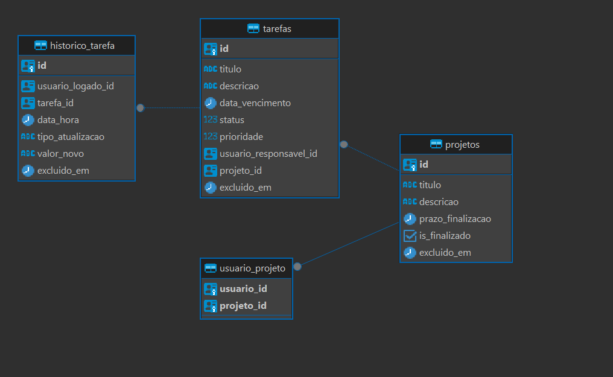

# Observações iniciais: 
Por ter que ter trabalhado além do horário para resolver urgências na empresa, não tive tempo hábil de finalizar todo o teste. Porém tenho muito interesse nessa vaga e gostaria de uma próxima conversa.
Seguem os pontos pendentes: 
- Implementação das Queries para leitura de dados [CQRS](#api--application);
    - Implementação do AutoMapper para melhor mapeamento das "DTOs"
- Retorno das Mensagens de erros de validação (a estrutura básica utilizando Notification Pattern está implementada porém não está sendo consumida, logo, as validações com erro não evidenciam as mensagens de erro).
    - Implementação de resposta padronizada nos endpoints vide exemplo abaixo:
    
    ``` 
    {
        "sucesso": bool,
        "dados": object,
        "mensagens": string[]
    }
    ```
- Implementação de Relatório
- Implementação de Logs
- Implementação de Testes Unitários (errei não começando por eles, rs. Tenho muito interesse em me desenvolver mais nesse sentido!)
- Implementação de Middlewares para tratamento de exceções e talvez para manipular o header (ou cookies) com os dados de usuário. [Falo disso abaixo](#sobre-os-usuarios) 

Os demais pontos solicitados estão funcionais, apesar das regras validadas não retornarem a mensagem de erro como citado no ponto 2.

Talvez nos próximos dias eu continue commitando no github novas alterações no projeto.

# Informações de execução: 
A api está sendo executada em um container e o BD (postgres) em outro container, organizados por 'docker-compose'

Obs.: Necessário Docker instalado.

Na raiz do projeto execute `docker-compose up --build`. A API estará disponível na porta 5000 e o postgres na porta 5432. A connection string está definida em variável de ambiente no arquivo docker-compose.yml, caso seja necessária abrir uma conexão.

Acesse o ([Swagger da API](http://localhost:5000/swagger/index.html)) e execute a Migration no endpoint `/api/Migration/ExecutarMigration`

# Fase 2: Refinamento
Visando o refinamento, primeiramente gostaria de entender melhor o uso e a dor que a aplicação está solucionando, para assim pensar em uma solução mais completa e poder modelar o domínio de acordo com a necessidade do negócio. Na minha visão, algumas regras que são fundamentais de serem discutidas são:

- Uma tarefa pode existir independente de um Projeto?
- Um projeto pode ter mais de usuario participante? (A implementação inicial contempla o relacionamento N x N porém não implementei a lógica de adicionar mais de um Usuário à um Projeto).

A partir disso poderíamos ter um rumo melhor sobre a funcionalidade do produto e assim buscar uma modelagem que atenda a novas melhorias.

# Fase 3: Final

## Estrutura desenvolvida: 
Aproveitando para pôr em prática alguns pontos que estou estudando sobre arquitetura de aplicação e DDD, arquitetei a aplicação simulando uma separação em contextos de domínio (Bounded Context). Pela informação de que seria um sistema interno e que não seria necessário autenticação nem operações de usuário, assumi que "Usuarios" seria um Bounded Context à parte e desenvolvi tudo dentro do "Projetos", seguindo a seguinte estrutura de pastas:

-src
    -Core 
    -Projetos (Bounded Context)
        -Api (atuando como Application)
        -Data
        -Domain
    -Usuarios (Bounded Context)

### Sobre os Usuarios
Não implementei nenhum tipo de validação sobre os usuários, porém adicionei no Header das requisições o ID e a ROLE do usuário logado, que serviria para uma aplicação interna assumindo que os dados são validos.
Uma abordagem que imaginei pensando em segurança seria ter, tanto o ID como a ROLE do usuário enviados em cookies ou criptografados no header.

### Domain Model
Aqui tentei aplicar os conceitos da modelagem Domain Model, implementando todas as entidades ricas e dando à elas a responsabilidade de validarem a regra de negócio.
Entendi a entidade "Projeto" como a raíz de agregação, então centralizei o contexto nela e dei a ela a responsabilidade de gerenciarem as entidades dependentes.
Meu entendimento foi de que Tarefa não existiria sem Projeto, me permitindo manter a responsabilidade da criação da Tarefa dentro da entidade Projeto.
Implementei também Eventos que são disparados após sucesso na execução dos [Commands ou Serviços](#api--application). Utilizei eles para registro do Histórico de alteração de tarefas. A mesma lógica pode ser utilizada para outras disparar outras ações como envio de email após atualização da tarefa ou disparo de algum webhook.

Assim ficou o Diagrama UML:



### Api / Application
Eu poderia chamar essa camada de "Application" e manter uma WEB API fora dos contextos, mas preferi usar a própria "Application" como API. Dessa forma a arquitetura fica mais maleável caso os contextos precisem ser separados em microsserviços. 
Nessa camada implementei um CQRS, mantendo todas as ações imperativas nos Commands e as leituras (não implementadas à tempo) nas Queries.

### Data
Utilizei o Entity Framework Core como ORM e mantive nessa camada apenas o necessário para acesso à dados e a implementação do Repository (Seguindo a lógica do DDD de 1 repository por raíz de agregação).